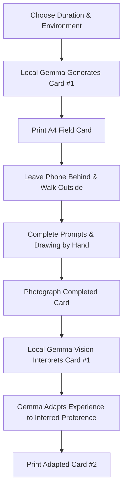
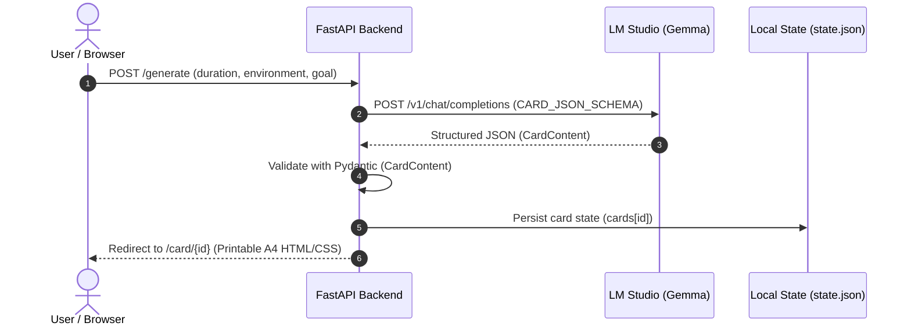
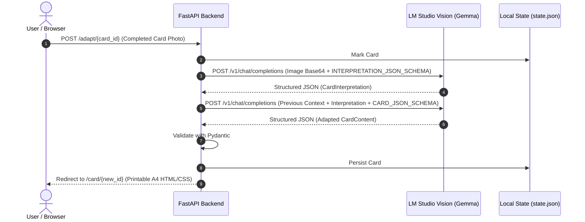

# Paperwalk

> A local-first outdoor experience generator. Local open-weight AI creates a printable physical walking card, you leave your phone behind, walk outside, and return with a handwritten card that adapts your next journey.

[](#hacktoberfest--touch-grass-challenge)
[](#why-gemma)
[](#technical-details)
[](#technical-details)

---

## Concept

Most modern AI products center the screen: they keep users typing, chatting, and scrolling. **Paperwalk** inverts this relationship:

> *"AI designs the experience, then gets out of the way."*

A user opens Paperwalk on a laptop, sets how much time they have (20, 40, or 60 minutes), selects an environment (Park, Campus, or Neighborhood), and optionally inputs a personal goal. 

A local Gemma model generates a tailored, one-page field card rendered directly as a printable A4 sheet. The user prints the card, leaves their phone at home, and heads outdoors with only a pen.

While walking, the user records physical observations, sketches a small discovery, circles sensory reflections, and notes future intentions. Upon returning, they upload a photograph of the completed card. Local Gemma vision reads the handwritten responses and sketches, extracts key observations, infers an observation preference, and generates an adapted **Card #2** for their next walk.

---

## Core Loop



---

## System Architecture

Paperwalk runs as a local web application backed by LM Studio's local OpenAI-compatible inference endpoint (`http://localhost:1234/v1`).

### Card #1 Generation Flow


### Card #2 Adaptation Flow


---

## Key Features

- **Local Inference & Vision:** Card generation and card photo interpretation run locally using Gemma models via LM Studio. No remote AI API calls are made during inference.
- **Constrained JSON Generation:** Model outputs are constrained to structured JSON schemas and strictly validated via Pydantic models (`CardContent` and `CardInterpretation`).
- **Printable A4 Field Cards:** Cards are styled precisely for standard A4 printing (`210mm x 297mm`) with designated sections for handwritten text, drawing boxes, and tactile corner registration marks.
- **Adaptive Continuity:** Card #2 is not a random generation; it directly reflects the user's recorded observations, sketches, and inferred preferences from Card #1.
- **Resilient Fallback Design:** If the local model is offline, slow, or fails validation, deterministic built-in fallback cards are served immediately so the user's physical walk is never blocked by an error trace.
- **Zero Heavy Dependencies:** Built cleanly with vanilla Python, FastAPI, Jinja2, vanilla HTML/CSS, and simple JSON state storage without React, databases, or cloud accounts.

---

## Technical Details

| Component | Implementation | Description |
|---|---|---|
| **Backend** | [FastAPI](https://fastapi.tiangolo.com/) | Lightweight asynchronous web server and routing |
| **Templates** | [Jinja2](https://jinja.palletsprojects.com/) | HTML template rendering for landing page and printable cards |
| **Styling** | Vanilla CSS | A4 print layout, dark olive UI identity, responsive design |
| **Validation** | [Pydantic v2](https://docs.pydantic.dev/) | Strict data validation for model inputs and outputs |
| **HTTP Client** | [HTTPX](https://www.python-httpx.org/) | Communication with LM Studio local REST API |
| **Local AI Runtime** | [LM Studio](https://lmstudio.ai/) | Local OpenAI-compatible server on `localhost:1234` |
| **AI Model** | [Google Gemma](https://ai.google.dev/gemma) | Tested with Gemma 3 4B (dynamically selects available Gemma model) |
| **State Storage** | File-backed JSON | Simple atomic storage in `data/state.json` |
| **Runtime** | Python 3.10+ | Standard virtual environment setup |

---

## Project Structure

```
Paperwalk/
├── app/
│   ├── main.py        # FastAPI routes: /, /generate, /card/{id}, /adapt/{id}, /api/health
│   ├── card.py        # Card #1 generation, Card #2 adaptation, and fallback dictionary
│   ├── llm.py         # LM Studio integration, model auto-discovery, text and vision requests
│   ├── prompts.py     # Prompt templates for card generation, vision interpretation, and adaptation
│   ├── schemas.py     # Pydantic schemas (CardContent, CardInterpretation) and JSON schemas
│   └── state.py       # Thread-safe JSON state storage in data/state.json
├── data/
│   └── state.json     # Card session and history storage (auto-created)
├── static/
│   └── style.css      # Design system, A4 printable styles, responsive rules
├── templates/
│   ├── index.html     # Landing page with walk configuration form
│   └── card.html      # Printable A4 card view and "I'm Back" upload section
├── requirements.txt   # Python dependencies
└── README.md          # Project documentation
```

---

## Installation & Setup

### Prerequisites

1. **Python 3.10+**
2. **LM Studio** installed and running on your machine.
3. A compatible vision-enabled **Gemma model** loaded in LM Studio (e.g. *Gemma 3 4B*).
4. In LM Studio, navigate to the **Developer tab** and start the local server on port `1234` (CORS enabled).

### 1. Clone & Set Up Python Environment

```bash
git clone https://github.com/Garg-Pankaj29/Paperwalk.git
cd Paperwalk

python3 -m venv .venv
source .venv/bin/activate
pip install -r requirements.txt
```

### 2. Verify LM Studio Connection

You can check whether LM Studio is reachable and see which model Paperwalk selects:

```bash
# Start FastAPI server
uvicorn app.main:app --reload --port 8000
```

Visit the health endpoint in your browser:
```
http://localhost:8000/api/health
```

Expected output when LM Studio is running:
```json
{
  "lm_studio": "up",
  "models": ["google/gemma-3-4b-it"],
  "will_use": "google/gemma-3-4b-it"
}
```

### 3. Optional Environment Variables

You can configure the LM Studio endpoint or pin a specific model ID using environment variables:

```bash
# Custom LM Studio URL (default: http://localhost:1234/v1)
export LMSTUDIO_URL="http://localhost:1234/v1"

# Pin a specific model ID instead of dynamic discovery
export LMSTUDIO_MODEL="google/gemma-3-4b-it"
```

---

## Usage Guide

1. **Open Paperwalk:** Navigate to `http://localhost:8000` in your web browser.
2. **Configure Your Walk:**
   - Select a duration: **20**, **40**, or **60 minutes**.
   - Select an environment: **Park**, **Campus**, or **Neighborhood**.
   - *(Optional)* Enter a personal intention or focus (e.g., *"listen for sounds"*, *"notice small architecture"*).
3. **Generate Card #1:** Click **Generate field card**. Local Gemma produces a mission and structured prompts.
4. **Print Card:** Click **Print card** (or press `Ctrl+P` / `Cmd+P`). The browser prints an A4 sheet.
5. **Leave the Screen:** Put your phone away and take only the printed card and a pen outdoors.
6. **Walk & Fill:** Follow the mission, answer the three observation questions, draw in the sketch box, circle your feelings, and note your reflection.
7. **Return & Upload:** Return to your browser at `http://localhost:8000/card/{card_id}`.
8. **Submit Photo:** In the **I'm Back** section, select or drag a clear photograph of your filled-out card.
9. **Local Interpretation:** Local Gemma vision reads your notes, sketches, and answers.
10. **Receive Card #2:** Paperwalk delivers an adapted Card #2 tailored specifically to what you focused on during your first walk.

---

## Design Philosophy

The modern software landscape is saturated with conversational AI and chat screens. Paperwalk embraces a different set of principles:

- **The Screen is the Shortest Part:** Technology should prepare you for an experience, not replace it.
- **Physical Paper as the Primary Interface:** A card does not ping notifications, drain batteries, or distract from surroundings. Writing with a pen invites slower, intentional reflection.
- **Subservient AI:** The model acts as a quiet curator. Once the card is printed, the AI completely disappears from the walk.

---

## Open Innovation & Local-First AI

Paperwalk demonstrates why open-weight models and local inference matter:

- **True Privacy for Personal Reflections:** Your physical handwriting, reflections, and sketches remain on your machine and are processed locally through LM Studio. No personal photos are shipped to remote third-party AI APIs.
- **Zero Hosted API Costs:** The application requires no API keys, accounts, subscriptions, or cloud infrastructure.
- **Inspectable & Hackable:** Developers can inspect every prompt in `app/prompts.py`, adjust schema constraints in `app/schemas.py`, or swap models without changing backend architecture.
- **Offline Capable:** Once dependencies and model weights are downloaded to your machine, Paperwalk runs entirely without an active internet connection.

---

## Why Gemma?

- **Open Weights & Local Execution:** Gemma models run smoothly on consumer hardware via LM Studio.
- **Structured Instruction Following:** Gemma handles constrained JSON schema decoding, ensuring responses parse cleanly into Pydantic models.
- **Multimodal Vision:** Gemma 3 vision capabilities enable reading handwritten card photographs and interpreting drawings directly on local hardware without sending images to third-party cloud services.

---

## Hacktoberfest & "Touch Grass" Challenge

Paperwalk was built for the **Hacktoberfest 2026 Open-Source AI Challenge** under the **"Touch Grass"** theme.

Instead of keeping developers tied to their terminal or desk, Paperwalk directly uses open-weight AI as a vehicle to disconnect, step outside, observe the real world, and return refreshed.

---

## Demo Video

- [Watch Demo Video](https://drive.google.com/file/d/1SrSOM8q2zxY1HUdKN_Cdqg91DctMvvO0/view?usp=sharing)

---

## Known Limitations

- **Handwriting Legibility:** Vision interpretation accuracy depends on photo clarity, lighting, and handwriting legibility.
- **Optimized for Short Form:** Cards are designed for concise handwritten entries rather than dense paragraphs.
- **Hardware Requirement:** Local multimodal inference requires a machine capable of running Gemma models via LM Studio.
- **Simple State Storage:** Session state is saved to a flat JSON file (`data/state.json`) rather than an external database.
- **Desktop/Laptop Centric:** The current workflow is optimized for printing from a laptop/desktop browser.

---

## Future Directions

- Card corner-marker detection for automatic perspective correction and cropping.
- Offline mobile camera capture and upload helper.
- Additional outdoor environments (Trails, Forests, Urban alleys, Waterways).
- Multi-day progressive walking journals.
- Physical card fold templates (pocket zines, field notebooks).

---

## Contributing

Contributions, feedback, and ideas are welcome:

1. Fork the repository.
2. Create a feature branch (`git checkout -b feature/improvement`).
3. Commit your changes.
4. Push to your branch and open a Pull Request.

---

## License

Add an appropriate open-source license before publishing if desired.
